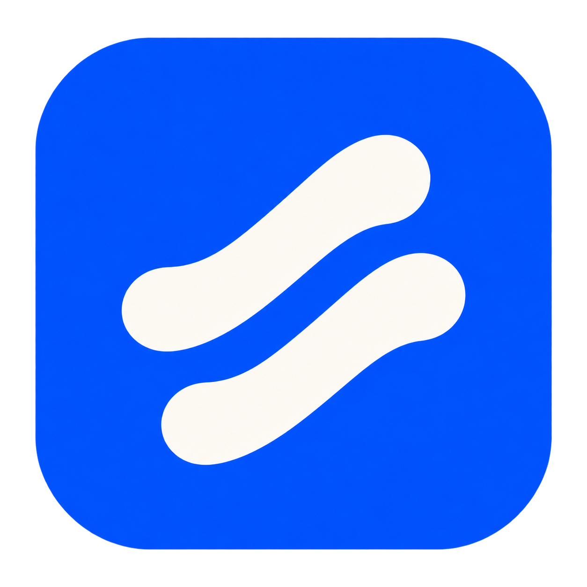

<p align="center">
  <a href="https://jgoneit.github.io/Docker2U/?lang=en"></a>
</p>

<h1 align="center">Docker2U</h1>
<p align="center"><strong>Your containers. One place to work.</strong><br />A desktop control panel for Docker on your Mac</p>
<p align="center">macOS 14+ · Apple Silicon · 한국어 / English · System / Light / Dark</p>
<p align="center">
  <a href="https://github.com/jgoneit/Docker2U/releases/download/v0.1.0-alpha.2/Docker2U_0.1.0-alpha.2_aarch64.dmg"><strong>Download alpha.2 DMG</strong></a> ·
  <a href="https://jgoneit.github.io/Docker2U/?lang=en">Product website</a> ·
  <a href="docs/INSTALL.md#english">Installation</a> ·
  <a href="https://github.com/jgoneit/Docker2U/releases/tag/v0.1.0-alpha.2">Release notes</a>
</p>
<p align="center"><a href="README.md">한국어</a> · <strong>English</strong></p>

---

Find the container that stopped, read its logs, and investigate what happened.
Move from **logs → incident → current diagnostics → terminal** in the same app.
Docker2U connects to your existing Docker CLI and local Linux Engine. Prepare the runtime separately.

## What you can do

| Your task | In Docker2U |
| --- | --- |
| See project health | Browse Compose projects and standalone containers with state, health, CPU, and memory |
| Read logs together | Search combined project or standalone-group logs and keep filters and reading position across views |
| Investigate an incident | Inspect logs and resource samples around an event, visit current diagnostics, connections, storage, or terminal, then return |
| Control selected containers | Start, stop, or restart one or several containers after reviewing the targets |
| Apply Compose changes | Register local Compose files, start or stop projects, and recreate selected services with pull, build, or existing-image preparation |
| Work inside a container | Connect to `/bin/sh` or `/bin/bash` in a running container and retain the session across views |
| Take an image with you | Export the image used by a container as `.tar`; volume data and container filesystem changes are excluded |

## Get started

1. **Prepare your environment.** Use an Apple Silicon Mac with macOS 14+, Docker CLI, and a running local Linux Engine. Compose features also require the Docker Compose plugin.
2. **Install the app.** Open the [DMG](https://github.com/jgoneit/Docker2U/releases/download/v0.1.0-alpha.2/Docker2U_0.1.0-alpha.2_aarch64.dmg), drag `Docker2U.app` to Applications, and launch it. This alpha is **ad-hoc signed and not notarized**. See [first-launch guidance](docs/INSTALL.md#english).
3. **Check the connection.** On launch, the app validates the local Unix socket and Linux Engine selected by Docker CLI's current context. If connection fails, inspect the CLI, context, and endpoint in app diagnostics.
4. **Choose a target.** Select a project or container to inspect its logs and state. Opening the terminal tab does not start a shell; press **Connect** when ready.

After changing the CLI context, use **Reconnect** to select the new Engine. Until then, the app stays with the previously connected Engine.
It does not switch the global context or install or start your runtime.

## What's new in alpha.2

- Combined logs, CPU and memory, and event history for Compose projects and standalone containers.
- Incident records connected to current diagnostics and retained terminal sessions, with a path back to the original incident.
- Compose start and stop, selected-service changes, storage inspection, and image export.
- Korean and English, with system, light, and dark themes.

See the [release notes](https://github.com/jgoneit/Docker2U/releases/tag/v0.1.0-alpha.2) for changes and validation of this release's artifacts.

## Before you use it

- **Platform:** macOS 14+ on Apple Silicon with a local Linux Engine. Windows, Intel Macs, and remote Docker endpoints are unsupported.
- **Alpha distribution:** no Developer ID signature or Apple notarization. macOS may block first launch. There is no automatic updater; install a new DMG manually.
- **Session-only records:** logs, samples, and events use bounded memory. Quitting or reconnecting to an Engine clears records. There is no persistent history or monitoring alert service. Missing collection intervals cannot be recovered. [Retention limits](docs/PROJECT-OBSERVATION.md#core-수집과-보관)
- **Terminals run real commands:** container user, network, and mount permissions apply. Up to 8 sessions and 2,000 scrollback lines per session are retained. Disconnecting does not guarantee that a command has stopped.
- **Check state after operations:** container and Compose actions change your environment. Command completion is not service readiness; failure or cancellation does not automatically undo changes already applied.
- **Out of scope:** runtime installation, a general-purpose host shell, Delete / Prune, and Compose file editing.

## Help and feedback

- [Install, update, or troubleshoot a connection](docs/INSTALL.md#english)
- [Logs and retention](docs/PROJECT-OBSERVATION.md) · [Standalone containers](docs/STANDALONE-INCIDENTS.md)
- [Incident investigation](docs/INCIDENT-REVIEW.md) · [Container terminals](docs/CONTAINER-TERMINAL.md)
- [Compose controls](docs/COMPOSE-PROJECT-CONTROLS.md) · [Apply selected services](docs/COMPOSE-APPLY.md)
- [Storage inspection](docs/COMPOSE-STORAGE.md) · [Image export](docs/IMAGE-EXPORT.md)
- [Report an issue or suggest a feature](https://github.com/jgoneit/Docker2U/issues)

Feature reference documents are currently in Korean. When reporting a problem, include the app version, macOS version, runtime, and reproduction steps.
Remove passwords, tokens, and private addresses from logs or diagnostic information before sharing.

## Development

Built with Rust, Tauri 2, React, and TypeScript. Use the Node, pnpm, and Rust toolchain versions pinned in the repository.

```sh
pnpm install --frozen-lockfile
pnpm test
pnpm build
pnpm rust:fmt
pnpm rust:test
pnpm native:dev
```

Build the Apple Silicon app and DMG:

```sh
pnpm native:build:dmg --ci -- --locked
```

App icons are generated from `assets/app-icon.png`. Docker CLI and Engine are not bundled.
Real Engine operations, native app checks, and release artifact validation are separate from automated tests.

- [Product and technical definition](docs/DEVELOPMENT-DEFINITION.md)
- [Local development and alpha validation](docs/MACOS-ALPHA.md)
- [DMG packaging and signing](docs/releases/MACOS-DMG.md)
- [CI](.github/workflows/ci.yml) · [Release history](https://github.com/jgoneit/Docker2U/releases)

The product website in `site/` is a separate static page. It does not connect to a Docker Engine.
